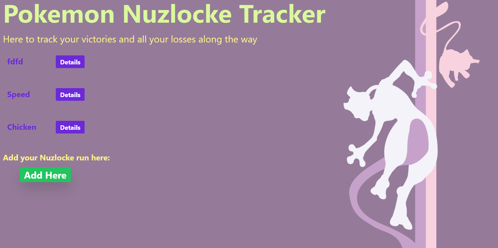

# Pokemon-Nuzlocke-Tracker

## About

If you're daring enough to take on the difficult task of completing a Nuzlocke, you deserve a proper Nuzlocke tracker so you can revisit all your triumphs and defeats
during your journey. Welcome to your own **POKEMON NUZLOCKE TRACKER** where you can record multiple runs, organize your party members, and revisit your fallen companions
and their stories. 

**CLICK HERE TO VISIT POKEMON NUZLOCKE TRACKER** https://pokemon-nuzlocke-tracker.herokuapp.com/

### Screenshots

**Landing Page**

**Add Nuzlockes Page**

**Show Teams Page**

**Add Pokemon Page**

**Edit Pokemon Page**

### Technologies Used
- HTML
- CSS
- JavaScript
- Express JS
- Tailwind CSS
- MongoDB
- Heroku
- Stack Overflow

## Future Updates
- Organize Pokemon by their life status & if they're in the party
- Improved styling
- An info page containing base stats, movesets, and other useful information about each Pokemon (using PokeAPI) & accessibility to it from the Show Teams Page
